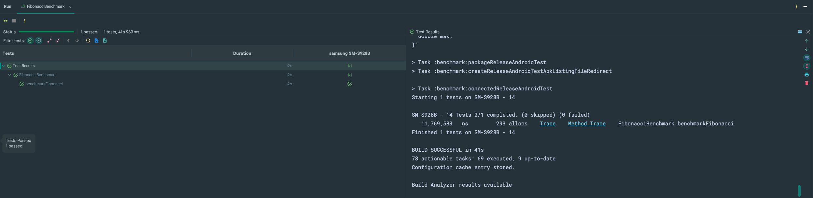
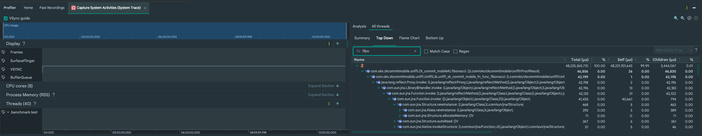

# ZK Commit Mobile Android

## Run Android Project and Example

- Install the latest version of Android Studio
- Open this project in Android Studio
- Run the project with an emulator or a physical device

## Benchmark

- The benchmark is done using the `benchmark` module
- Add tests that call Rust codes
  in `benchmark/src/androidTest/kotlin/com/okx/zkcommitmobile/benchmark` (
  See [FibonacciBenchmark.kt](benchmark/src/androidTest/kotlin/com/okx/zkcommitmobile/benchmark/FibonacciBenchmark.kt)
  for an example)
- A physical device is required to run the benchmark

### Screenshots

